# Data Science Academy 👩‍💻  

## Microsoft Power BI Para Business Intelligence e Data Science 📊

🔗 [Laboratório Prático 1 | Dashboard Analítico de Vendas Globais](/LaboratorioPratico1)

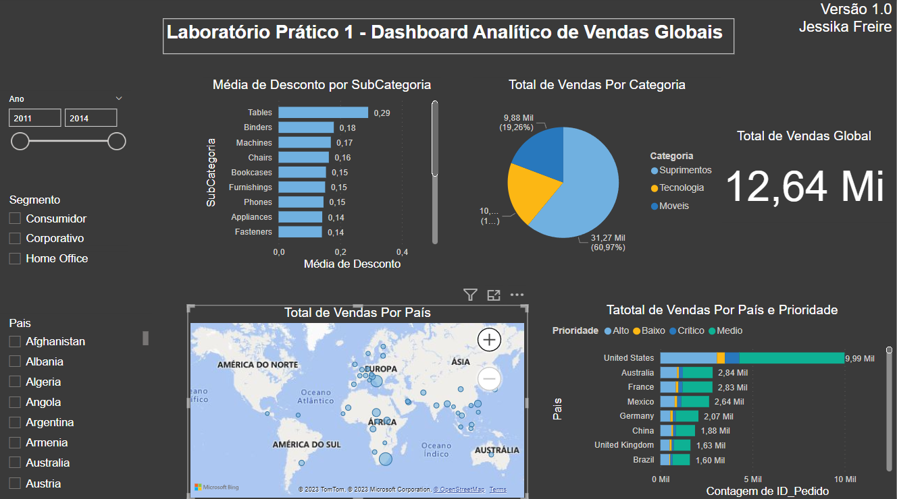

🔗 [Laboratório Prático 2 | Dashboard de Vendas, Custo, Margem de Lucro e KPI](/LaboratorioPratico2)

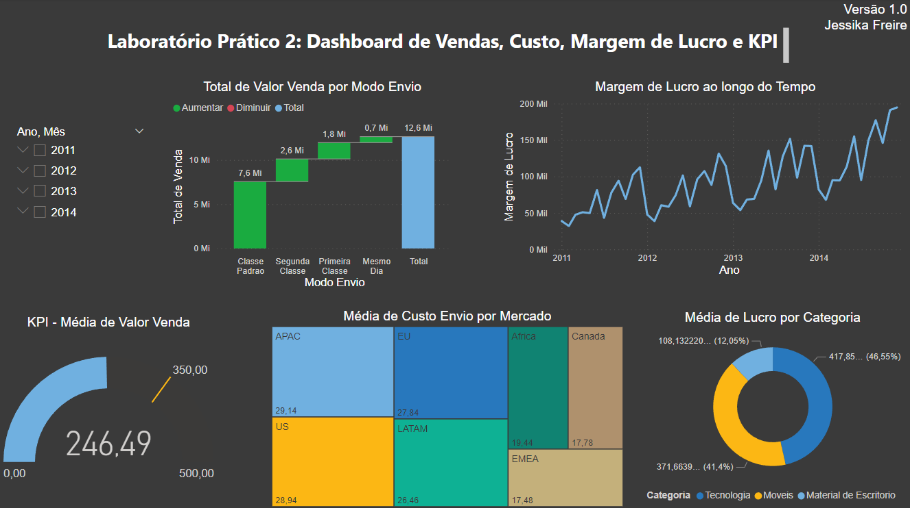

🔗 [Miniprojeto 1 | Análise de Campanhas de Marketing com Power BI](/Miniprojeto1)

🔗 [Miniprojeto 2 | Dashboard Comercial - Performance de Vendas](/Miniprojeto2)

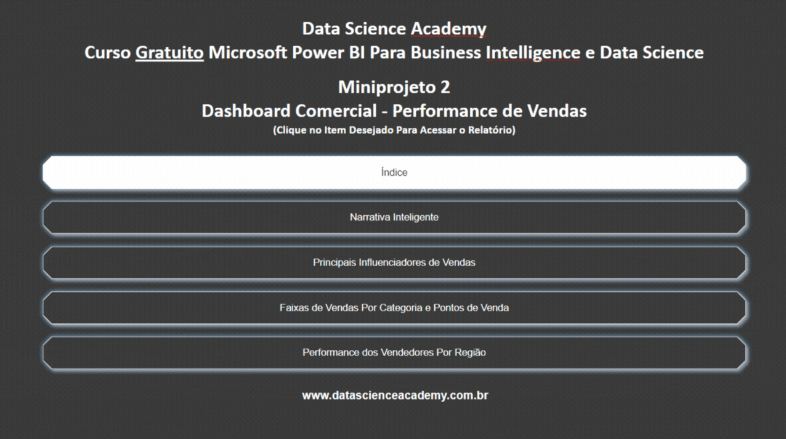

🔗 [Miniprojeto 3 | Análise de Dados de RH com Power BI](/Miniprojeto3)

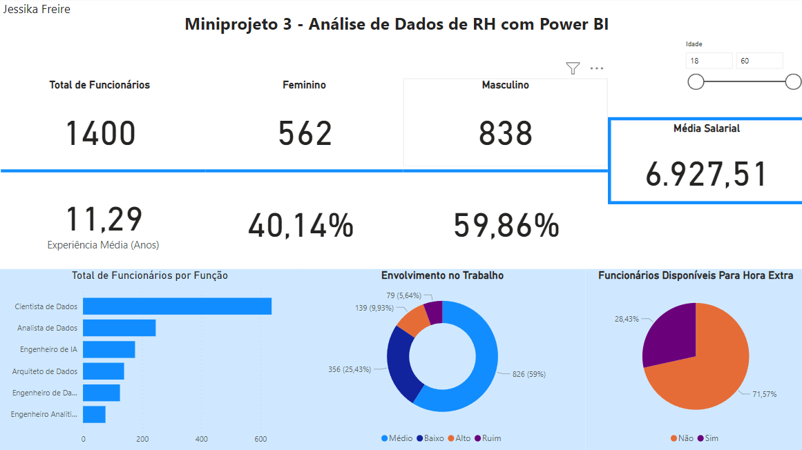

🔗 [Miniprojeto 4 | Análise de Dados de Logística](/Miniprojeto4)

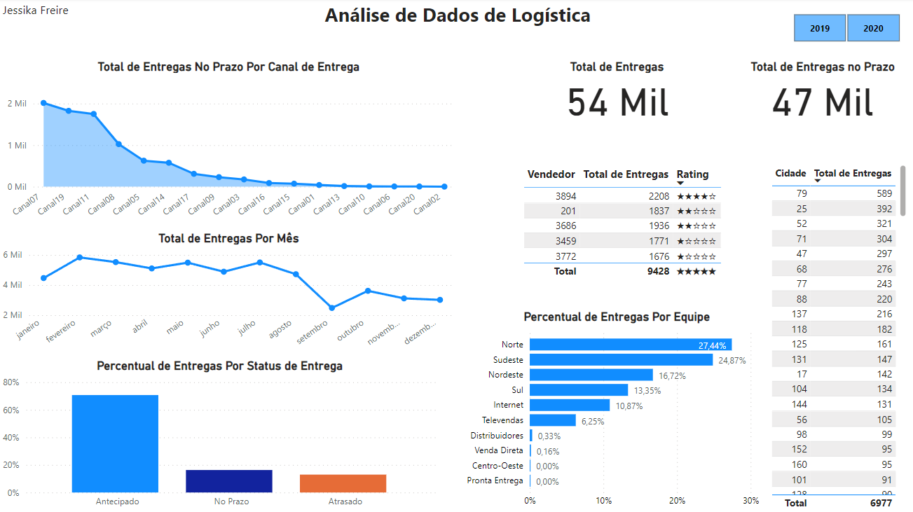

🔗 [Miniprojeto 5 | Dashboard de Análise Financeira](/Miniprojeto5)

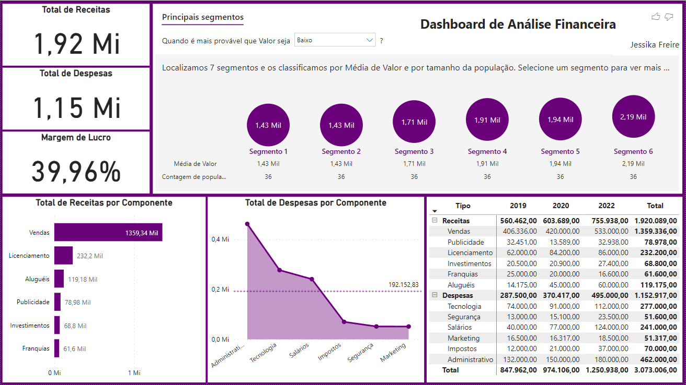

🔗 [Laboratório Prático 3 | Balanço Patrimonial com Visual de Matriz no Power BI](/LaboratorioPratico3)

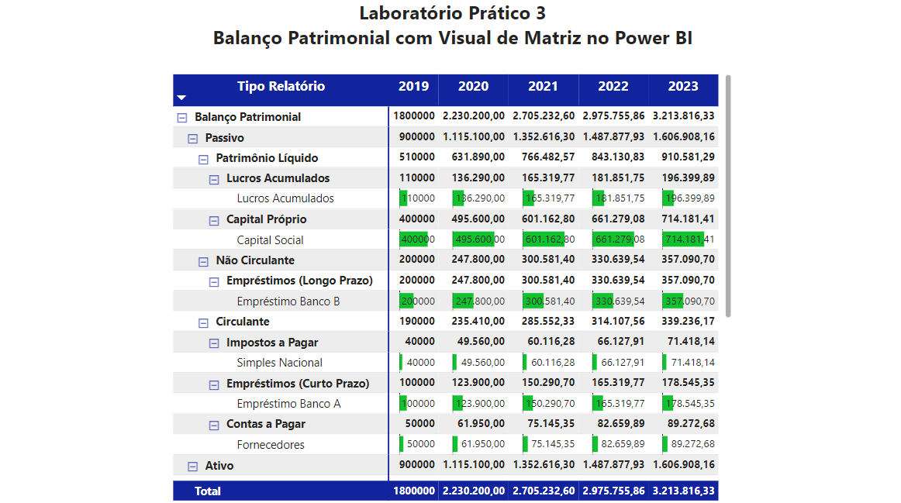

🔗 [Miniprojeto 6 | Dashboard Analítico do Mercado de Ações com Narrativa Inteligente](/Miniprojeto6)

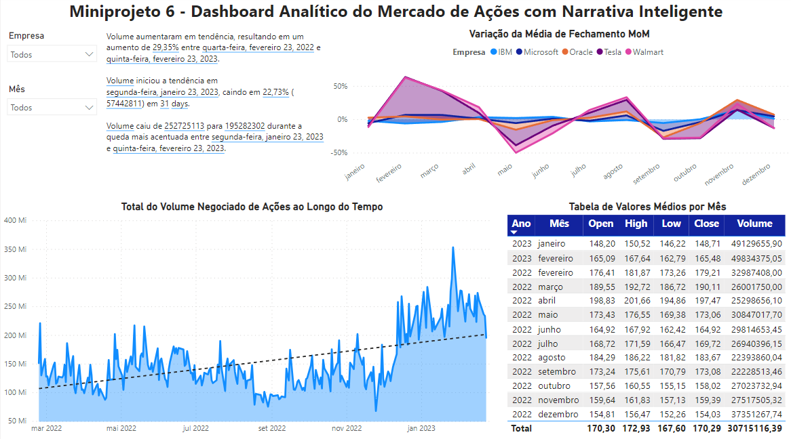

🔗 [Exercícios 1 e 2 | Análise Estatística no Power BI](/Exercicio)

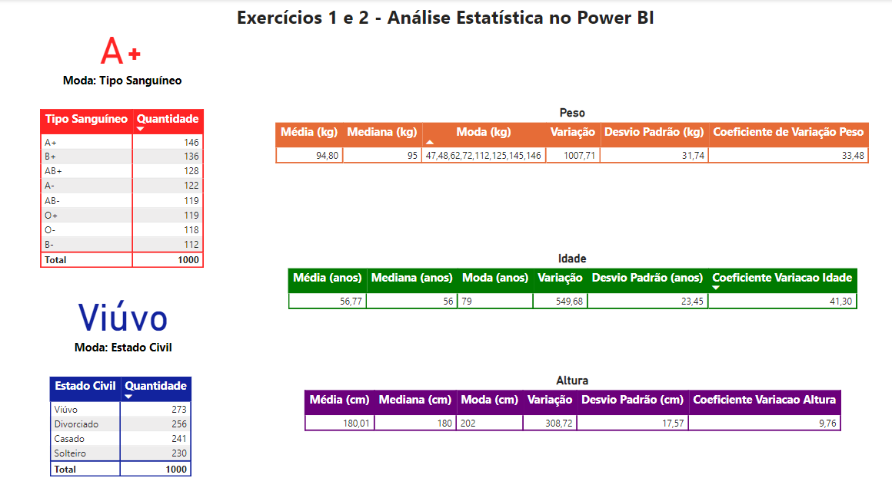

🔗 [Laboratório Prático 4 | Limpeza e Manipulação de Dados com Power BI](/LaboratorioPratico4)

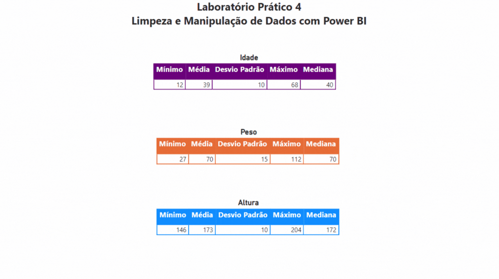

🔗 [Laboratório Prático 5 | Manipulação de Dados com Power Query M Language](/LaboratorioPratico5)

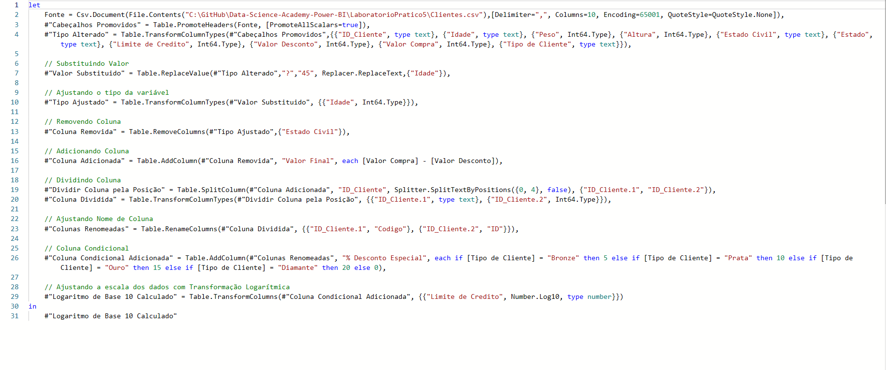

🔗 [Laboratório Prático 6 | Power BI e Banco de Dados](/LaboratorioPratico6)

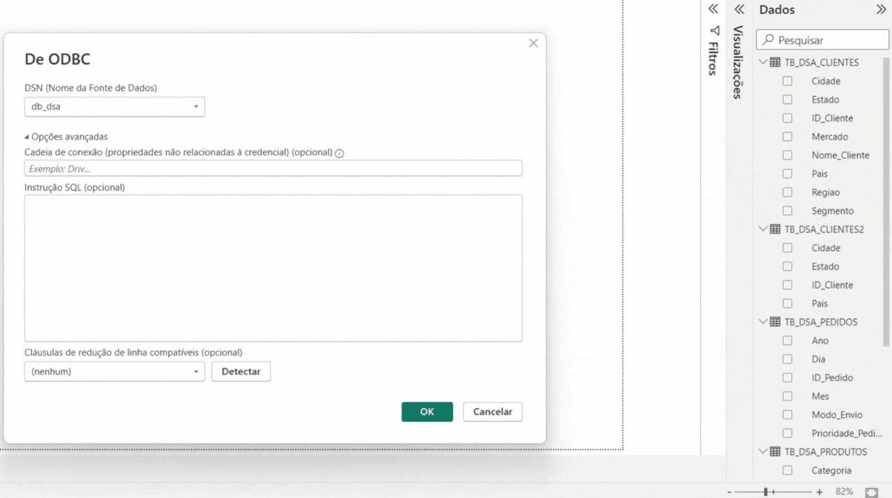

